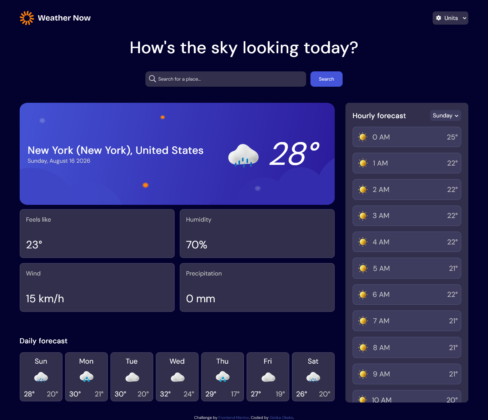

# Frontend Mentor - Weather app solution

This is a solution to the [Weather app challenge on Frontend Mentor](https://www.frontendmentor.io/challenges/weather-app-K1FhddVm49). Frontend Mentor challenges help you improve your coding skills by building realistic projects. 

## Table of contents

- [Overview](#overview)
  - [The challenge](#the-challenge)
  - [Screenshot](#screenshot)
  - [Links](#links)
- [My process](#my-process)
  - [Built with](#built-with)
  - [What I learned](#what-i-learned)
  - [Continued development](#continued-development)
  - [What is next](#what-is-next)
  - [Useful resources](#useful-resources)
- [Author](#author)

## Overview

### The challenge

Users should be able to:

- Search for weather information by entering a location in the search bar
- View current weather conditions including temperature, weather icon, and location details
- See additional weather metrics like "feels like" temperature, humidity percentage, wind speed, and precipitation amounts
- Browse a 7-day weather forecast with daily high/low temperatures and weather icons
- View an hourly forecast showing temperature changes throughout the day
- Switch between different days of the week using the day selector in the hourly forecast section
- Toggle between Imperial and Metric measurement units via the units dropdown 
- Switch between specific temperature units (Celsius and Fahrenheit) and measurement units for wind speed (km/h and mph) and precipitation (millimeters) via the units dropdown
- View the optimal layout for the interface depending on their device's screen size
- See hover and focus states for all interactive elements on the page

### Screenshot

### Links

- Live Site URL: [Add live site URL here](https://weather-app-main-alpha.vercel.app/)

## My process

### Built with

- Semantic HTML5 markup
- CSS custom properties
- Flexbox
- CSS Grid
- Mobile-first workflow
- Object-oriented programming
- API integration

### What I learned

This has been a long time coming, but I have finally gotten the hang of HTML, CSS, and JS and have profficiency in all three. This was without a doubt the most heavy project so far from frontend mentor. I learned about the model-view-controller architecture, object-oriented programming, and classes, and integrated those concepts into this project. I also learned about fetch, API, using the backend, and also touched lightly on Node.JS and Browserify. I now feel comfortable dabbling in other programming languages such as C# and Python.

### Continued development

The CSS is admittedly more sloppy than I usually do it. I was so focused on the JavaScripts that I neglected perfecting the styles.As for what is upcoming for me, I am going to learn about the backend and Node.JS next, as well as starting a C# course. My next frontend project is probably going to be the speed typing test. I want to use these new JS skills to program something closer to a web game.

### What is next

As for what is upcoming for myself, I am probably going to learn about the backend and Node.JS as well as start course on either C# or Python. My next frontend mentor project is going to be the speed typing test because I want to use these new JS skills to program something closer to a web game. I am also likely going to start designing my own website and begin applying for my masters.

### Useful resources

- [SuperSimpleDev](https://www.youtube.com/watch?v=EerdGm-ehJQ) - SuperSimpleDev's JavaScript course it what to took me from basic level javascript skills to near mastery within a two weeks or so. Highly recommend.
- [Net Ninja](https://www.youtube.com/watch?v=iWOYAxlnaww) - He is the reason I am skilled in HTML and CSS. The first six tutorials in in his JS course (which are free on YouTube) gave me a good foundation to go into SuperSimpleDev's course and allowed me to skip a lot of the beginning tutorials of the latter.
- Not really a resource but applying to a bunch of web development jobs and taking on the coding tests as exercises helped a ton!

## Author

- Frontend Mentor - [@ginikaifeanyi88-web](https://www.frontendmentor.io/profile/ginikaifeanyi88-web)
